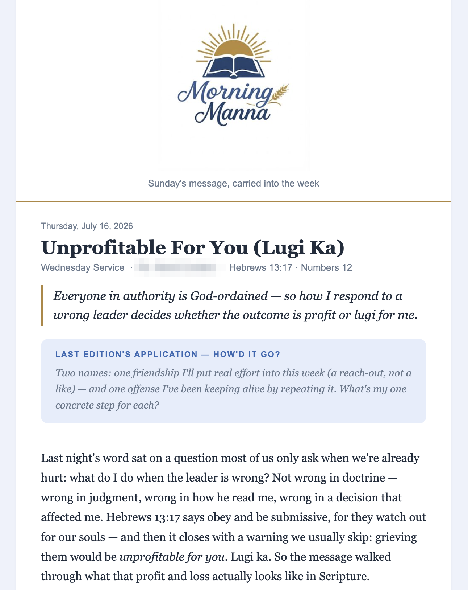

  

# Morning Manna

I take notes during church services. For years they just sat in a notes app. This project turns them into a daily devotional email, written in my own voice, that lands in my inbox after my morning devotions.

Built with Claude Code on the **WAT framework** (Workflows · Agent · Tools), from Nate Herk's AI Automation Society.

## How it works

- **Workflows** (`workflows/`) — plain-language SOPs, not code. `daily_devotional.md` is the recipe: notes in, devotional email out.
- **Agent** — Claude Code reads the workflow, pulls my latest notes from Notion via MCP, extracts the theme and memory verse, and writes the devotional in my voice.
- **Tools** (`tools/`) — deterministic Python. No AI, no network surprises. The agent decides *what* to say; the tools decide *how it renders*.

Delivery is human-in-the-loop by design: the agent produces a Gmail draft, I review it, I hit send. The agent never sends on its own.

## The tools

| Tool | What it does |
|---|---|
| `render_newsletter.py` | Edition JSON → branded HTML email |
| `fetch_sermon.sh` | Pulls a preaching recording (YouTube or Vimeo) — subtitles first, audio fallback |
| `transcribe_sermon.py` | faster-whisper transcription when no subtitles exist |
| `compact_vtt.py` | Compresses subtitle files into a readable transcript |
| `generate_image.py` / `make_transparent.py` | Branding pipeline — image generation plus local alpha keying and compositing |
| `check_repo_clean.sh` | Guard script — has to pass before anything gets committed |

## What an edition looks like

  

## What's public and what isn't

The engine is public; the content is not. Generated editions, raw notes, branding assets, and keys are all gitignored, and the guard script enforces that before every commit. So what you're reading here is the machinery, not my devotional life.

## Why this exists

Partly for the daily devotional itself. But mostly because I wanted every lesson from the automation challenge to end as a permanent capability, not a pile of project files. This repo is what that looks like in practice.

---

_Rei Cordero · [github.com/ReiKemuel](https://github.com/ReiKemuel) · rkscordero@gmail.com_
